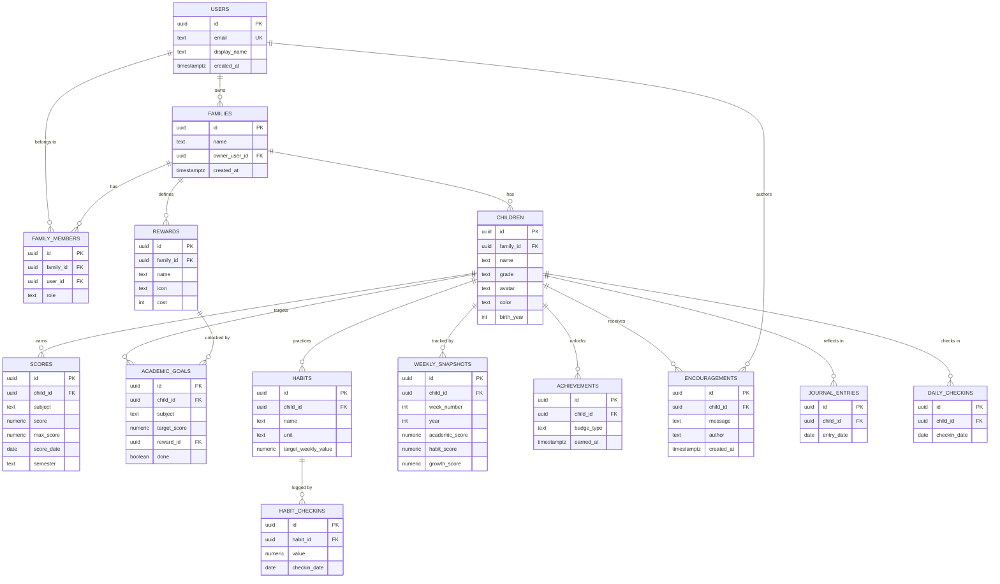

# Data Model & Database Design

> Status: **Design brainstorm** — target backend is **PostgreSQL (via Supabase)**, per
> `Architecture_System.md` ("Later: Firebase / Supabase") and `Architechture_Decision.md`.
> Today the app persists to `localStorage`; this document defines the schema we migrate to.

---

## 1. Design goals

| Goal | How the schema supports it |
| --- | --- |
| **Multi-tenant by family** | Every row is reachable from a `family_id`; Row-Level Security isolates families. |
| **Multiple caregivers per child** | `family_members` join table (parent, guardian, grandparent, viewer). |
| **Cross-device sync** | Server-side source of truth replaces per-browser `localStorage`. |
| **Growth analytics** | `weekly_snapshots` stores academic / habit / growth scores per ISO week. |
| **Extensible & auditable** | UUID PKs, `created_at` / `updated_at`, soft references, enums for controlled values. |
| **Cheap to start** | Fits Supabase free tier; no exotic extensions required. |

Naming conventions: `snake_case` tables/columns, plural table names, UUID primary keys
(`gen_random_uuid()`), timestamps in `timestamptz` (UTC).

---

## 2. Entity–relationship overview



---

## 3. Core entities

### 3.1 `users`
Authenticated accounts (backed by Supabase `auth.users`; this is the app-facing profile).

| Column | Type | Notes |
| --- | --- | --- |
| `id` | `uuid` PK | Matches `auth.users.id`. |
| `email` | `text` UNIQUE NOT NULL | Login identity. |
| `display_name` | `text` | Shown in UI. |
| `avatar_url` | `text` NULL | Optional profile picture. |
| `created_at` | `timestamptz` DEFAULT `now()` | |

> `role` is intentionally **not** on `users` — a person can be an *owner* in one family and a
> *viewer* in another. Role lives on `family_members` (§3.3).

### 3.2 `families`
The tenant boundary. Everything a family owns hangs off `family_id`.

| Column | Type | Notes |
| --- | --- | --- |
| `id` | `uuid` PK | |
| `name` | `text` NOT NULL | e.g. "Nguyễn Family". |
| `owner_user_id` | `uuid` FK → `users.id` | Billing / admin owner. |
| `created_at` | `timestamptz` DEFAULT `now()` | |

### 3.3 `family_members` (join: users ↔ families)
Enables multiple caregivers and per-family roles.

| Column | Type | Notes |
| --- | --- | --- |
| `id` | `uuid` PK | |
| `family_id` | `uuid` FK → `families.id` ON DELETE CASCADE | |
| `user_id` | `uuid` FK → `users.id` ON DELETE CASCADE | |
| `role` | `member_role` enum | `owner` \| `parent` \| `guardian` \| `viewer`. |
| `created_at` | `timestamptz` DEFAULT `now()` | |
| | | UNIQUE (`family_id`, `user_id`). |

### 3.4 `children`
A tracked child. (App type `Student`.)

| Column | Type | Notes |
| --- | --- | --- |
| `id` | `uuid` PK | |
| `family_id` | `uuid` FK → `families.id` ON DELETE CASCADE | |
| `name` | `text` NOT NULL | |
| `grade` | `text` | Free text, e.g. "Grade 3", "Preparing for Grade 8". |
| `avatar` | `text` | Emoji or `photo_url`. |
| `color` | `text` | Theme accent (hex), used in charts. |
| `birth_year` | `int` NULL | Optional. |
| `created_at` | `timestamptz` DEFAULT `now()` | |

---

## 4. Academic & habit tracking

### 4.1 `scores`
A single recorded result. (App type `ScoreEntry`.)

| Column | Type | Notes |
| --- | --- | --- |
| `id` | `uuid` PK | |
| `child_id` | `uuid` FK → `children.id` ON DELETE CASCADE | |
| `subject` | `text` NOT NULL | e.g. Math, Reading (see §7 on normalization). |
| `score` | `numeric(4,2)` NOT NULL | 0–10 scale. |
| `max_score` | `numeric(4,2)` DEFAULT `10` | Supports other scales. |
| `score_date` | `date` NOT NULL | |
| `semester` | `semester_enum` | `first` \| `second`. |
| `grade_level` | `int` NULL | School grade the score was earned in. |
| `term` | `text` NULL | e.g. "Term 1". |
| `notes` | `text` NULL | |
| `created_at` | `timestamptz` DEFAULT `now()` | |

Index: `(child_id, subject, score_date)`.

### 4.2 `academic_goals`
Subject target + optional reward. (App type `Goal`.)

| Column | Type | Notes |
| --- | --- | --- |
| `id` | `uuid` PK | |
| `child_id` | `uuid` FK → `children.id` ON DELETE CASCADE | |
| `title` | `text` | e.g. "Score 9+ in Math". |
| `subject` | `text` NULL | |
| `target_score` | `numeric(4,2)` NULL | Progress % = subject avg ÷ target. |
| `reward_id` | `uuid` FK → `rewards.id` ON DELETE SET NULL | |
| `points` | `int` DEFAULT `0` | Awarded on completion. |
| `done` | `boolean` DEFAULT `false` | |
| `done_at` | `timestamptz` NULL | |
| `created_at` | `timestamptz` DEFAULT `now()` | |

### 4.3 `rewards`
Family-level reward catalog. (App type `Reward`.) Scoped to `family_id` so it can be shared
across siblings.

| Column | Type | Notes |
| --- | --- | --- |
| `id` | `uuid` PK | |
| `family_id` | `uuid` FK → `families.id` ON DELETE CASCADE | |
| `name` | `text` NOT NULL | |
| `icon` | `text` | Emoji. |
| `cost` | `int` DEFAULT `0` | Points required. |
| `category` | `text` NULL | Toys / Experiences / Treats… |
| `claimed` | `boolean` DEFAULT `false` | (Or move to `reward_claims`, §9.) |
| `created_at` | `timestamptz` DEFAULT `now()` | |

### 4.4 `habits`
A recurring activity with a weekly target. (App type `HabitGoal`.)

| Column | Type | Notes |
| --- | --- | --- |
| `id` | `uuid` PK | |
| `child_id` | `uuid` FK → `children.id` ON DELETE CASCADE | |
| `name` | `text` NOT NULL | e.g. Reading, Coding, Piano. |
| `icon` | `text` | Emoji. |
| `unit` | `text` | minutes / sessions / pages / tasks / custom. |
| `target_weekly_value` | `numeric` NOT NULL | Weekly goal. |
| `created_at` | `timestamptz` DEFAULT `now()` | |

### 4.5 `habit_checkins`
> **New vs. current app.** Today the app stores only a rolling `weeklyProgress` number.
> Splitting into per-event check-ins gives history, streaks, and accurate weekly rollups.

| Column | Type | Notes |
| --- | --- | --- |
| `id` | `uuid` PK | |
| `habit_id` | `uuid` FK → `habits.id` ON DELETE CASCADE | |
| `value` | `numeric` NOT NULL | Amount logged (minutes, sessions…). |
| `checkin_date` | `date` NOT NULL | |
| `created_at` | `timestamptz` DEFAULT `now()` | |

Weekly progress becomes `SUM(value)` grouped by ISO week — no more manual counter resets.
Index: `(habit_id, checkin_date)`.

---

## 5. Analytics, gamification & engagement

### 5.1 `weekly_snapshots`
One row per child per ISO week — the backbone of the growth charts.
(App type `GrowthSnapshot`, extended with the academic/habit breakdown.)

| Column | Type | Notes |
| --- | --- | --- |
| `id` | `uuid` PK | |
| `child_id` | `uuid` FK → `children.id` ON DELETE CASCADE | |
| `year` | `int` NOT NULL | |
| `week_number` | `int` NOT NULL | ISO week (1–53). |
| `week_start` | `date` NOT NULL | Monday of the week. |
| `academic_score` | `numeric(4,2)` | Avg of scores. |
| `habit_score` | `numeric(4,2)` | Weekly habit completion → 0–10. |
| `growth_score` | `numeric(4,2)` | **academic × 0.7 + habit × 0.3** (see `utils/growth.ts`). |
| `created_at` | `timestamptz` DEFAULT `now()` | |
| | | UNIQUE (`child_id`, `year`, `week_number`). |

### 5.2 `achievements`
Badges a child has unlocked. (Derived from `utils/badges.ts`.)

| Column | Type | Notes |
| --- | --- | --- |
| `id` | `uuid` PK | |
| `child_id` | `uuid` FK → `children.id` ON DELETE CASCADE | |
| `badge_type` | `text` NOT NULL | Stable key, e.g. `streak_7`, `math_master`. |
| `earned_at` | `timestamptz` DEFAULT `now()` | |
| `meta` | `jsonb` NULL | Extra context (subject, streak length). |
| | | UNIQUE (`child_id`, `badge_type`). |

### 5.3 `encouragements`
Notes of support. (App type `Encouragement`.)

| Column | Type | Notes |
| --- | --- | --- |
| `id` | `uuid` PK | |
| `child_id` | `uuid` FK → `children.id` ON DELETE CASCADE | |
| `message` | `text` NOT NULL | |
| `author` | `text` NOT NULL | Display label, e.g. "Grandma". |
| `author_user_id` | `uuid` FK → `users.id` NULL | Set when a logged-in member writes it. |
| `created_at` | `timestamptz` DEFAULT `now()` | |

### 5.4 `journal_entries`
Weekly reflection. (App type `JournalEntry`.) Arrays stored as `text[]`.

| Column | Type | Notes |
| --- | --- | --- |
| `id` | `uuid` PK | |
| `child_id` | `uuid` FK → `children.id` ON DELETE CASCADE | |
| `entry_date` | `date` NOT NULL | |
| `went_well` | `text[]` | ✅ |
| `to_improve` | `text[]` | 🎯 |
| `next_goals` | `text[]` | 🚀 |
| `parent_reflection` | `text` | ❤️ |
| `created_at` | `timestamptz` DEFAULT `now()` | |

### 5.5 `daily_checkins`
Streak tracking (current app `checkIns: string[]`).

| Column | Type | Notes |
| --- | --- | --- |
| `id` | `uuid` PK | |
| `child_id` | `uuid` FK → `children.id` ON DELETE CASCADE | |
| `checkin_date` | `date` NOT NULL | |
| | | UNIQUE (`child_id`, `checkin_date`). |

---

## 6. Enums

```sql
CREATE TYPE member_role   AS ENUM ('owner', 'parent', 'guardian', 'viewer');
CREATE TYPE semester_enum AS ENUM ('first', 'second');
```

---

## 7. Subjects: text vs. lookup

The app currently uses **free-text** subjects. Two options:

- **Keep as text** (recommended for MVP) — simplest; matches current `courses.ts` seed data.
- **Normalize** later with a `subjects(id, family_id, name, icon)` table + `scores.subject_id`
  FK, if families start wanting per-subject settings, colors, or renaming.

Start with text; add the lookup table only when a feature needs it.

---

## 8. Mapping: current app → database

| App (`types.ts` / store) | Table |
| --- | --- |
| `Parent` | `users` + `family_members` |
| `Student` | `children` |
| `ScoreEntry` | `scores` |
| `Goal` | `academic_goals` |
| `Reward` | `rewards` (+ `reward_claims`, §9) |
| `HabitGoal` (`weeklyProgress`) | `habits` (+ `habit_checkins` for progress) |
| `JournalEntry` | `journal_entries` |
| `GrowthSnapshot` | `weekly_snapshots` |
| `Encouragement` | `encouragements` |
| `checkIns: string[]` | `daily_checkins` |
| badges (`utils/badges.ts`) | `achievements` |
| `photos` (dataURL) | `children.avatar` / Supabase Storage bucket |
| `schoolYearOverrides` | `child_school_years` (§9) |

---

## 9. Deferred / future tables

- **`reward_claims`** — `(id, reward_id, child_id, claimed_at, points_spent)` to replace the
  boolean `rewards.claimed` and support a proper points ledger + history.
- **`child_school_years`** — `(child_id, grade_level, start_date, end_date)` for the app's
  `schoolYearOverrides`.
- **`points_ledger`** — append-only earn/spend rows for auditable reward economics.
- **`invitations`** — invite a co-parent/grandparent to a family by email.

---

## 10. Security model (Supabase Row-Level Security)

Every table is reachable from a `family_id` (directly or via `child_id → children.family_id`).
RLS policy pattern:

```sql
-- Enable on each table
ALTER TABLE children ENABLE ROW LEVEL SECURITY;

-- A user may read/write rows for families they belong to
CREATE POLICY "family members access children"
ON children FOR ALL
USING (
  family_id IN (
    SELECT family_id FROM family_members WHERE user_id = auth.uid()
  )
);
```

For child-scoped tables (`scores`, `habits`, …), join through `children`:

```sql
CREATE POLICY "family members access scores"
ON scores FOR ALL
USING (
  child_id IN (
    SELECT c.id FROM children c
    JOIN family_members fm ON fm.family_id = c.family_id
    WHERE fm.user_id = auth.uid()
  )
);
```

Write-restricted roles: `viewer` gets `SELECT` only; enforce with `FOR SELECT` policies plus
separate `FOR INSERT/UPDATE/DELETE` policies gated on `role IN ('owner','parent','guardian')`.

---

## 11. Starter DDL (PostgreSQL)

```sql
create extension if not exists "pgcrypto";

create type member_role   as enum ('owner','parent','guardian','viewer');
create type semester_enum as enum ('first','second');

create table users (
  id           uuid primary key default gen_random_uuid(),
  email        text unique not null,
  display_name text,
  avatar_url   text,
  created_at   timestamptz not null default now()
);

create table families (
  id            uuid primary key default gen_random_uuid(),
  name          text not null,
  owner_user_id uuid not null references users(id),
  created_at    timestamptz not null default now()
);

create table family_members (
  id         uuid primary key default gen_random_uuid(),
  family_id  uuid not null references families(id) on delete cascade,
  user_id    uuid not null references users(id) on delete cascade,
  role       member_role not null default 'parent',
  created_at timestamptz not null default now(),
  unique (family_id, user_id)
);

create table children (
  id         uuid primary key default gen_random_uuid(),
  family_id  uuid not null references families(id) on delete cascade,
  name       text not null,
  grade      text,
  avatar     text,
  color      text,
  birth_year int,
  created_at timestamptz not null default now()
);

create table rewards (
  id         uuid primary key default gen_random_uuid(),
  family_id  uuid not null references families(id) on delete cascade,
  name       text not null,
  icon       text,
  cost       int not null default 0,
  category   text,
  claimed    boolean not null default false,
  created_at timestamptz not null default now()
);

create table scores (
  id          uuid primary key default gen_random_uuid(),
  child_id    uuid not null references children(id) on delete cascade,
  subject     text not null,
  score       numeric(4,2) not null,
  max_score   numeric(4,2) not null default 10,
  score_date  date not null,
  semester    semester_enum,
  grade_level int,
  term        text,
  notes       text,
  created_at  timestamptz not null default now()
);
create index scores_child_subject_date_idx on scores (child_id, subject, score_date);

create table academic_goals (
  id           uuid primary key default gen_random_uuid(),
  child_id     uuid not null references children(id) on delete cascade,
  title        text,
  subject      text,
  target_score numeric(4,2),
  reward_id    uuid references rewards(id) on delete set null,
  points       int not null default 0,
  done         boolean not null default false,
  done_at      timestamptz,
  created_at   timestamptz not null default now()
);

create table habits (
  id                  uuid primary key default gen_random_uuid(),
  child_id            uuid not null references children(id) on delete cascade,
  name                text not null,
  icon                text,
  unit                text,
  target_weekly_value numeric not null,
  created_at          timestamptz not null default now()
);

create table habit_checkins (
  id           uuid primary key default gen_random_uuid(),
  habit_id     uuid not null references habits(id) on delete cascade,
  value        numeric not null,
  checkin_date date not null,
  created_at   timestamptz not null default now()
);
create index habit_checkins_habit_date_idx on habit_checkins (habit_id, checkin_date);

create table weekly_snapshots (
  id             uuid primary key default gen_random_uuid(),
  child_id       uuid not null references children(id) on delete cascade,
  year           int not null,
  week_number    int not null,
  week_start     date not null,
  academic_score numeric(4,2),
  habit_score    numeric(4,2),
  growth_score   numeric(4,2),
  created_at     timestamptz not null default now(),
  unique (child_id, year, week_number)
);

create table achievements (
  id         uuid primary key default gen_random_uuid(),
  child_id   uuid not null references children(id) on delete cascade,
  badge_type text not null,
  earned_at  timestamptz not null default now(),
  meta       jsonb,
  unique (child_id, badge_type)
);

create table encouragements (
  id             uuid primary key default gen_random_uuid(),
  child_id       uuid not null references children(id) on delete cascade,
  message        text not null,
  author         text not null,
  author_user_id uuid references users(id),
  created_at     timestamptz not null default now()
);

create table journal_entries (
  id                uuid primary key default gen_random_uuid(),
  child_id          uuid not null references children(id) on delete cascade,
  entry_date        date not null,
  went_well         text[] not null default '{}',
  to_improve        text[] not null default '{}',
  next_goals        text[] not null default '{}',
  parent_reflection text,
  created_at        timestamptz not null default now()
);

create table daily_checkins (
  id           uuid primary key default gen_random_uuid(),
  child_id     uuid not null references children(id) on delete cascade,
  checkin_date date not null,
  created_at   timestamptz not null default now(),
  unique (child_id, checkin_date)
);
```

---

## 12. Suggested next steps

1. **Confirm the tenant model** — single-family MVP vs. multi-caregiver from day one
   (`family_members` vs. `role` on `users`).
2. **Decide subject strategy** — text now, `subjects` lookup later (§7).
3. **Pick the growth-score owner** — compute snapshots in the client (as today) or via a
   Postgres function / scheduled job.
4. **Stand up Supabase** — run the DDL, enable RLS, wire a thin data layer to replace
   `utils/storage.ts` so the UI keeps working while the source of truth moves server-side.
5. **Migration script** — one-time export of `localStorage` → Supabase for existing users.