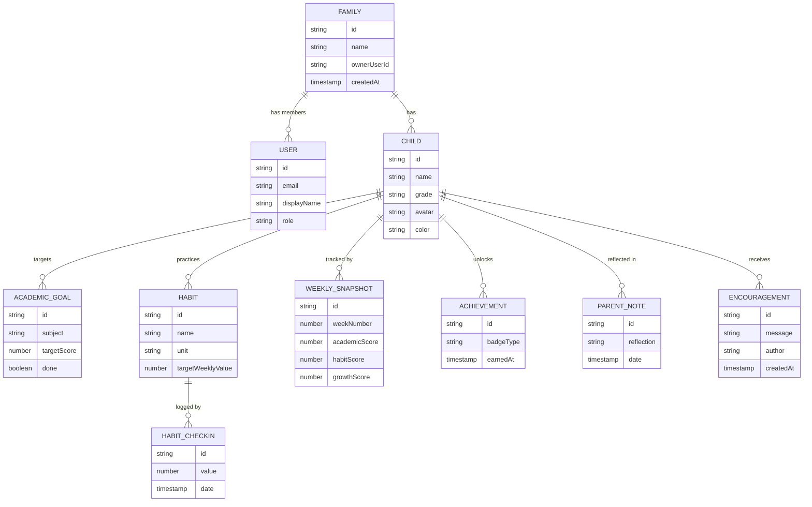
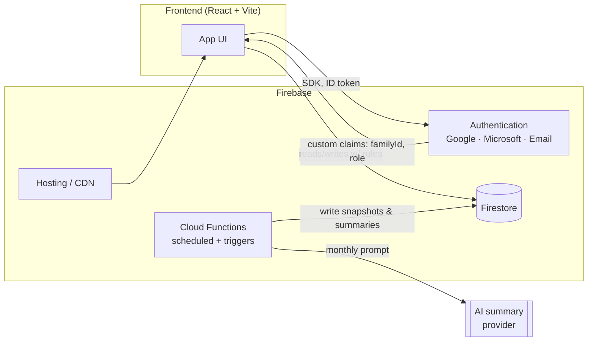
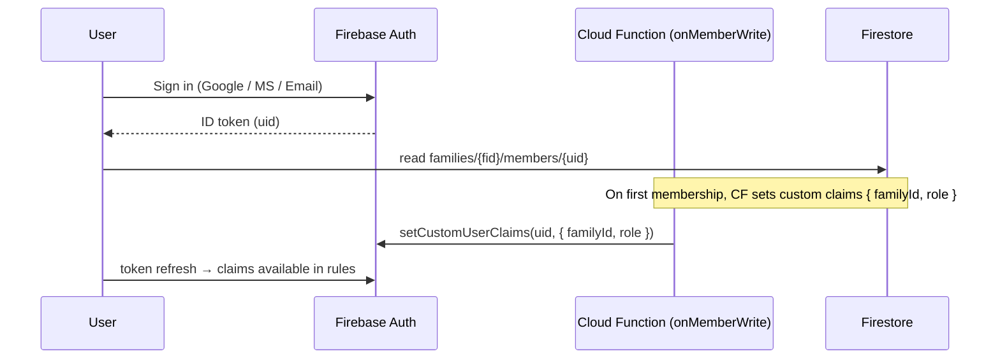

# Firebase Architecture Brainstorm

> Status: **Design brainstorm** — a Firebase-native alternative to the Supabase/Postgres
> design in `Data_Model.md`. The app currently runs on localStorage with a Supabase data
> layer; this document explores what a Firebase backend would look like so we can compare
> and decide. Nothing here is wired into the app yet.

---

## 1. Entity hierarchy (ERD)



Tree view (the shape that drives the Firestore layout in §3):

```
Family
 ├── Users            (members: owner / viewer)
 └── Children
        ├── AcademicGoals
        ├── Habits
        │     └── HabitCheckins
        ├── WeeklySnapshots
        ├── Achievements
        ├── ParentNotes
        └── Encouragements
```

---

## 2. Firebase services at a glance



| Service | Role |
| --- | --- |
| **Authentication** | Identity via Google, Microsoft (OIDC), and Email/Password. Roles (`owner` / `viewer`) carried as custom claims. |
| **Firestore** | Document database holding all family data; access gated by Security Rules. |
| **Cloud Functions** | Scheduled jobs (weekly snapshot, monthly AI summary) + reactive triggers (recompute on write). |
| **Hosting** | Serves the built SPA over Firebase's CDN with SPA rewrites. |

---

## 3. Firestore data model

Firestore is schemaless documents. Two viable layouts:

- **A — Nested subcollections (recommended).** Mirrors the ERD, keeps queries naturally
  scoped, and makes Security Rules simple (walk up the path to `families/{familyId}`).
- **B — Flat top-level collections** with a `familyId`/`childId` field on every doc. Easier
  cross-family admin queries, but every rule must re-check ownership via `get()`.

### Recommended layout (A)

```
families/{familyId}
  ├─ (doc)         { name, ownerUserId, createdAt }
  ├─ members/{userId}      { role: 'owner' | 'viewer', email, displayName, joinedAt }
  └─ children/{childId}
        ├─ (doc)   { name, grade, avatar, color, birthYear, createdAt }
        ├─ academicGoals/{goalId}   { title, subject, targetScore, rewardId, points, done, doneAt }
        ├─ habits/{habitId}
        │     ├─ (doc)              { name, icon, unit, targetWeeklyValue, createdAt }
        │     └─ checkins/{checkinId}   { value, date, createdAt }
        ├─ weeklySnapshots/{snapshotId} { year, weekNumber, weekStart, academicScore, habitScore, growthScore }
        ├─ achievements/{achievementId} { badgeType, earnedAt, meta }
        ├─ parentNotes/{noteId}     { date, wentWell[], toImprove[], nextGoals[], reflection }
        └─ encouragements/{encId}   { message, author, authorUserId, createdAt }

users/{userId}    { email, displayName, avatarUrl, familyIds: [ ... ], createdAt }
rewards → embedded per family: families/{familyId}/rewards/{rewardId} { name, icon, cost, category, claimed }
```

Notes:
- **`users/{userId}`** is a global profile keyed by the Auth UID; `familyIds` lets the client
  find which family to open on load. Membership + role lives in `families/{familyId}/members/{userId}`.
- **`weeklySnapshots`** doc id can be deterministic — e.g. `2026-W29` — so the weekly job
  upserts idempotently.
- **`checkins`** as a subcollection of a habit preserves history; the UI's `weeklyProgress`
  becomes a sum of this week's checkin `value`s (or a denormalised counter on the habit doc,
  updated by a trigger — see §5).

### Mapping to the app's types (`src/types.ts`)

| App type | Firestore location |
| --- | --- |
| `Parent` | `users/{uid}` + `families/{fid}/members/{uid}` |
| `Student` | `families/{fid}/children/{cid}` |
| `Goal` | `.../children/{cid}/academicGoals/{id}` |
| `Reward` | `families/{fid}/rewards/{id}` |
| `HabitGoal` (`weeklyProgress`) | `.../habits/{id}` (+ `checkins` subcollection) |
| `JournalEntry` | `.../children/{cid}/parentNotes/{id}` |
| `GrowthSnapshot` | `.../children/{cid}/weeklySnapshots/{id}` |
| `Encouragement` | `.../children/{cid}/encouragements/{id}` |
| badges (`utils/badges.ts`) | `.../children/{cid}/achievements/{id}` |
| `checkIns` (streak) | `.../children/{cid}/dailyCheckins/{yyyy-mm-dd}` |

---

## 4. Authentication

**Providers:** Google, Microsoft (`microsoft.com` OIDC), Email/Password.

**Roles:** `owner` and `viewer`.
- Stored authoritatively in `families/{familyId}/members/{userId}.role`.
- Mirrored into **custom claims** (`{ familyId, role }`) by a Cloud Function on membership
  change, so Security Rules can check `request.auth.token.role` without an extra `get()`.



Bootstrap on first sign-in (client or callable function): create `users/{uid}`, create a
`families/{fid}` with `ownerUserId = uid`, and a `members/{uid}` doc with `role: 'owner'`.

---

## 5. Cloud Functions

```mermaid
flowchart TD
    W["Scheduled: every Sunday 23:00"] --> WG[generateWeeklySnapshots]
    WG -->|per child: academic 70% + habit 30%| FSW[(weeklySnapshots)]

    M["Scheduled: end of month"] --> MS[generateFamilySummary]
    MS -->|aggregate month data| P[Build prompt]
    P --> AI[[AI provider]]
    AI --> MS
    MS --> FSM[(families/{id}/summaries)]

    T["Trigger: onWrite habits/checkins"] --> RC[recomputeWeeklyProgress]
    RC --> FSH[(habit doc counter)]
```

### Weekly snapshot job (`generateWeeklySnapshots`)
- **Schedule:** every Sunday (Cloud Scheduler cron, e.g. `0 23 * * 0`).
- For each child: `academicScore` = avg of scores, `habitScore` = weekly completion → 0–10,
  `growthScore = academic × 0.7 + habit × 0.3` (matches `utils/growth.ts`).
- Upserts `weeklySnapshots/{year-Www}` (idempotent id).

### Monthly AI family summary (`generateFamilySummary`)
- **Schedule:** end of month (e.g. `0 8 28-31 * *` guarded to the last day, or last-day cron).
- Aggregates the month's growth deltas, completed goals, habit %, subjects tested.
- Builds a prompt → calls the AI provider → stores the narrative at
  `families/{familyId}/summaries/{yyyy-mm}`. This is the server-side counterpart of the
  in-app **🤖 AI Monthly Summary** feature.

### Reactive trigger (optional) — `recomputeWeeklyProgress`
- On write to `.../habits/{id}/checkins/**`, recompute and denormalise `weeklyProgress` onto
  the habit doc so the UI reads a single field without summing subcollections.

---

## 6. Security Rules (sketch)

```javascript
rules_version = '2';
service cloud.firestore {
  match /databases/{db}/documents {

    function signedIn() { return request.auth != null; }
    function isMember(familyId) {
      return signedIn()
        && exists(/databases/$(db)/documents/families/$(familyId)/members/$(request.auth.uid));
    }
    function memberRole(familyId) {
      return get(/databases/$(db)/documents/families/$(familyId)/members/$(request.auth.uid)).data.role;
    }
    function canWrite(familyId) {
      return isMember(familyId) && memberRole(familyId) in ['owner', 'parent', 'guardian'];
    }

    match /users/{userId} {
      allow read, write: if signedIn() && request.auth.uid == userId;
    }

    match /families/{familyId} {
      allow read: if isMember(familyId);
      allow write: if signedIn() && request.resource.data.ownerUserId == request.auth.uid;

      match /members/{userId} {
        allow read: if isMember(familyId);
        allow write: if request.auth.uid == userId || canWrite(familyId);
      }

      // Everything else under the family: read for members, write for non-viewers.
      match /{document=**} {
        allow read:  if isMember(familyId);
        allow write: if canWrite(familyId);
      }
    }
  }
}
```

> `viewer` gets read-only; `owner` (and future `parent`/`guardian`) can write. Using custom
> claims (`request.auth.token.role`) instead of `get()` avoids a read per rule evaluation.

---

## 7. Hosting & deployment

```
firebase.json
{
  "hosting": {
    "public": "Web/dist",
    "ignore": ["firebase.json", "**/.*", "**/node_modules/**"],
    "rewrites": [{ "source": "**", "destination": "/index.html" }]
  },
  "firestore": { "rules": "firestore.rules", "indexes": "firestore.indexes.json" },
  "functions": { "source": "functions", "runtime": "nodejs20" }
}
```

- Build the SPA (`npm run build` → `Web/dist`) then `firebase deploy`.
- SPA rewrite sends all routes to `index.html` for React Router.
- Composite indexes (e.g. snapshots by `child + weekStart`) declared in `firestore.indexes.json`.

---

## 8. Firebase vs. the current Supabase design

| Concern | Firebase (this doc) | Supabase (`Data_Model.md`, implemented) |
| --- | --- | --- |
| Data model | Documents / subcollections | Relational tables + FKs |
| Access control | Security Rules + custom claims | Row-Level Security policies |
| Auth providers | Google, Microsoft, Email built-in | Email today; OAuth providers configurable |
| Scheduled work | Cloud Functions + Scheduler | pg_cron / Edge Functions |
| Relational queries / joins | Limited; denormalise | Native SQL joins |
| Current app wiring | None yet | `supabaseStore.ts` + dual-mode store already built |

**Recommendation:** the relational shape (scores, goals, subject averages, joins for the
monthly summary) fits **Supabase/Postgres** more naturally and is already integrated. Prefer
**Firebase** if you specifically want turnkey Google/Microsoft sign-in, offline-first client
caching, and simple serverless scheduled jobs without managing SQL. Both are viable — pick one
backend rather than maintaining two.

---

## 9. Open questions / next steps

1. **Confirm backend choice** — Firebase or continue with the already-wired Supabase path.
2. **Roles** — is `viewer` (read-only relative) needed at launch, or owner-only for MVP?
3. **Habit progress** — store per-event `checkins` (history) or a single counter per habit?
4. **AI summary hosting** — run the monthly summary server-side (Cloud Function) or keep the
   existing client-side AI Tutor summary?
5. **Snapshot id scheme** — `2026-W29` deterministic ids for idempotent weekly upserts.
